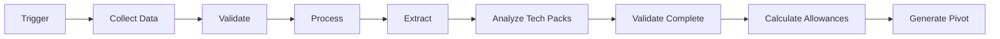

# Trim Ordering Automation System

Automated system for processing trim orders with minimal manual intervention.

## 📋 Table of Contents

- [Overview](#overview)
- [Architecture](#architecture)
- [Quick Start](#quick-start)
- [Features](#features)
- [Documentation](#documentation)
- [Development](#development)
- [Deployment](#deployment)

## 🎯 Overview

This system automates the trim ordering workflow, reducing manual intervention from 7+ steps to an automated pipeline that:

1. Collects data from NG system and PO files
2. Processes and validates data
3. Extracts trim components and style information
4. Analyzes tech packs for detailed component information
5. Calculates appropriate allowances
6. Generates and submits Pivot entries

**Result**: 95%+ automation rate with 90% reduction in manual processing time

---

## 🏗️ Architecture

The system follows a microservices architecture with the following key components:

### Core Services
- **Data Collection Service**: Fetches data from NG system and tech packs
- **Data Processing Service**: Cleans and normalizes data
- **Extraction Service**: Extracts components and style information
- **Tech Pack Analyzer**: Parses tech packs using OCR and ML
- **Validation Service**: Validates data at each stage
- **Allowance Calculator**: Calculates trim allowances
- **Pivot Generator**: Creates and submits Pivot entries

### Supporting Infrastructure
- **Workflow Orchestrator**: Coordinates service execution (Airflow)
- **Message Queue**: Decouples services (RabbitMQ)
- **Cache**: Redis for performance
- **Monitoring**: Prometheus + Grafana
- **Logging**: ELK Stack

See [SYSTEM_ARCHITECTURE.md](./SYSTEM_ARCHITECTURE.md) for detailed architecture diagrams and component breakdowns.

---

## 🚀 Quick Start

### Prerequisites
- Docker and Docker Compose
- Python 3.11+ (for local development)
- Access to NG system database
- Pivot API credentials

### 1. Clone and Setup

```bash
# Clone the repository
git clone <repository-url>
cd purchasing-automation

# Copy environment file
cp env.example .env

# Edit .env with your credentials
nano .env
```

### 2. Configure Environment

Edit `.env` file with your specific configuration:

```bash
# Database
DB_PASSWORD=your_secure_password

# NG System
NG_DB_HOST=your-ng-host.com
NG_DB_PASSWORD=your-ng-password

# Pivot API
PBOT_API_KEY=your-pbot-key
```

### 3. Run with Docker

```bash
# Start all services
docker-compose up -d

# Check status
docker-compose ps

# View logs
docker-compose logs -f api
```

### 4. Access Services

- **API**: http://localhost:8000
- **API Docs**: http://localhost:8000/docs
- **Airflow**: http://localhost:8080 (admin/admin)
- **RabbitMQ Management**: http://localhost:15672 (guest/guest)
- **Grafana**: http://localhost:3000 (admin/admin)
- **Kibana**: http://localhost:5601

### 5. Local Development

```bash
# Create virtual environment
python -m venv venv
source venv/bin/activate  # On Windows: venv\Scripts\activate

# Install dependencies
pip install -r requirements.txt

# Initialize database
alembic upgrade head

# Run tests
pytest

# Start development server
uvicorn src.api.gateway:app --reload
```

---

## ✨ Features

### Automated Processing
- ✅ Automatic data collection from NG system
- ✅ PO file downloading and parsing
- ✅ Tech pack analysis with OCR
- ✅ Component extraction and categorization
- ✅ Allowance calculation with ML predictions
- ✅ Automatic Pivot entry generation

### Intelligence & Learning
- 📊 ML-based pattern recognition
- 🤖 Anomaly detection
- 📈 Historical trend analysis
- 🎯 Smart allowance predictions

### Error Handling
- ⚠️ Automated retry logic
- 🔍 Dead letter queue for failures
- 📧 Email and Slack notifications
- 📊 Manual override capabilities

### Security
- 🔐 API key authentication
- 🛡️ Role-based access control
- 🔒 Encrypted data storage
- 📝 Complete audit trail

### Monitoring & Observability
- 📊 Real-time dashboards
- 📈 Performance metrics
- 🚨 Automated alerting
- 📋 Complete logging

---

## 📚 Documentation

### Core Documentation
- **[SYSTEM_ARCHITECTURE.md](./SYSTEM_ARCHITECTURE.md)**: Complete system architecture with diagrams
- **[IMPLEMENTATION_GUIDE.md](./IMPLEMENTATION_GUIDE.md)**: Step-by-step implementation guide
- **[API_SPECIFICATION.md](./API_SPECIFICATION.md)**: API endpoints and examples

### Key Features

#### 1. Workflow Automation


#### 2. Data Flow
```
NG System → Data Collection → Processing → Extraction
Tech Packs → Analysis → Validation → Allowances → Pivot
```

#### 3. Error Handling
- Automatic retries with exponential backoff
- Dead letter queue for failed items
- Manual intervention queue
- Comprehensive logging

---

## 🛠️ Development

### Project Structure

```
purchasing-automation/
├── src/                    # Source code
│   ├── api/               # API Gateway
│   ├── services/          # Microservices
│   ├── orchestration/      # Workflow tasks
│   ├── models/            # Database models
│   ├── storage/           # Data layer
│   ├── config/            # Configuration
│   └── utils/             # Utilities
├── tests/                 # Test suite
├── workflows/             # Airflow DAGs
├── docs/                  # Additional documentation
├── docker-compose.yml     # Docker setup
├── Dockerfile            # Container definition
├── requirements.txt      # Python dependencies
└── README.md            # This file
```

### Running Tests

```bash
# Run all tests
pytest

# Run with coverage
pytest --cov=src tests/

# Run specific test file
pytest tests/test_data_collection.py

# Run with verbose output
pytest -v
```

### Code Quality

```bash
# Format code
black src/

# Lint code
flake8 src/
pylint src/

# Type checking
mypy src/
```

---

## 🚢 Deployment

### Production Deployment

#### 1. Infrastructure Setup

**AWS/Azure/GCP**
- Provision compute instances
- Setup managed databases (RDS/Cloud SQL)
- Configure object storage (S3/Azure Blob/GCS)
- Setup networking and security

#### 2. Kubernetes Deployment

```bash
# Build and push Docker image
docker build -t trim-automation:latest .
docker push your-registry/trim-automation:latest

# Deploy to Kubernetes
kubectl apply -f k8s-deployment.yaml
kubectl apply -f k8s-service.yaml
kubectl apply -f k8s-ingress.yaml
```

#### 3. Configure Monitoring

- Setup Prometheus scraping
- Configure Grafana dashboards
- Setup alerting rules
- Configure log aggregation

### Scaling Considerations

#### Horizontal Scaling
- Run multiple API instances behind load balancer
- Scale Airflow workers
- Use Kubernetes HPA (Horizontal Pod Autoscaler)

#### Vertical Scaling
- Increase database resources
- Optimize Redis memory
- Tune worker concurrency

#### Performance Optimization
- Enable caching at all levels
- Use CDN for static assets
- Implement database query optimization
- Use connection pooling

---

## 📊 Monitoring & Metrics

### Key Metrics to Monitor

1. **Automation Rate**: % of orders fully automated
2. **Processing Time**: Time per workflow execution
3. **Error Rate**: % of failed workflows
4. **System Health**: Service uptime and availability
5. **Throughput**: Orders processed per hour/day

### Dashboards

Access Grafana dashboards at http://localhost:3000

Default dashboards include:
- System Overview
- Workflow Performance
- Error Tracking
- Resource Utilization

---

## 🔧 Configuration

### Environment Variables

See [env.example](./env.example) for all configuration options.

### Feature Flags

Control system behavior via environment variables:

```bash
# Enable/disable ML features
ENABLE_ML_FEATURES=true

# Enable/disable OCR
ENABLE_OCR=true

# Auto-submit to Pivot
ENABLE_AUTO_SUBMIT=false
```

### Business Rules

Configure allowance calculations and validation rules in `src/services/allowance_calculator/rules.yaml`

---

## 🤝 Contributing

### Development Workflow

1. Create feature branch
```bash
git checkout -b feature/your-feature
```

2. Make changes and test
```bash
pytest
black src/
flake8 src/
```

3. Commit with descriptive messages
```bash
git commit -m "feat: add tech pack OCR parsing"
```

4. Push and create pull request

### Coding Standards

- Follow PEP 8 style guide
- Write comprehensive tests
- Add docstrings to functions
- Update documentation
- Keep commits atomic and clear

---

## 🐛 Troubleshooting

### Common Issues

#### Database Connection Errors
```bash
# Check database is running
docker-compose ps postgres

# Check connection string
echo $DB_HOST
echo $DB_PASSWORD

# Restart database
docker-compose restart postgres
```

#### Workflow Not Running
```bash
# Check Airflow
docker-compose logs airflow-scheduler

# Verify DAG is loaded
# Visit http://localhost:8080
```

#### API Not Responding
```bash
# Check API logs
docker-compose logs api

# Restart API
docker-compose restart api

# Check health endpoint
curl http://localhost:8000/health
```

### Debug Mode

Enable debug logging:
```bash
export LOG_LEVEL=DEBUG
export DEBUG=True
docker-compose up
```

---

## 📞 Support

### Getting Help

1. Check documentation in `/docs`
2. Review logs in `logs/app.log`
3. Check monitoring dashboards
4. Contact DevOps team
5. Escalate to development team

### Reporting Issues

Use GitHub Issues or internal ticketing system:
- Describe the issue clearly
- Include error messages and logs
- Provide steps to reproduce
- Add relevant context

---

## 📄 License

[Specify your license here]

---

## 🙏 Acknowledgments

- Built with FastAPI, Airflow, and modern Python
- Inspired by microservices best practices
- Designed for scalability and maintainability

---

## 📈 Roadmap

### Phase 1 (Current)
- ✅ Core architecture
- ✅ Basic automation
- ✅ NG system integration
- ✅ Pivot integration

### Phase 2 (Next)
- 🔄 Advanced ML features
- 🔄 Automated tech pack parsing
- 🔄 Predictive allowances
- 🔄 Dashboard UI

### Phase 3 (Future)
- 📅 Full AI integration
- 📅 Multi-tenant support
- 📅 Mobile app
- 📅 Advanced analytics

---

## 📞 Contact

For questions or support:
- **Email**: support@example.com
- **Slack**: #trim-automation
- **Wiki**: [Internal Wiki Link]

---

**Last Updated**: January 2024
**Version**: 1.0.0

