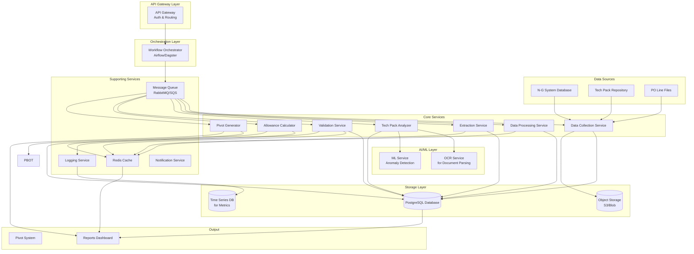
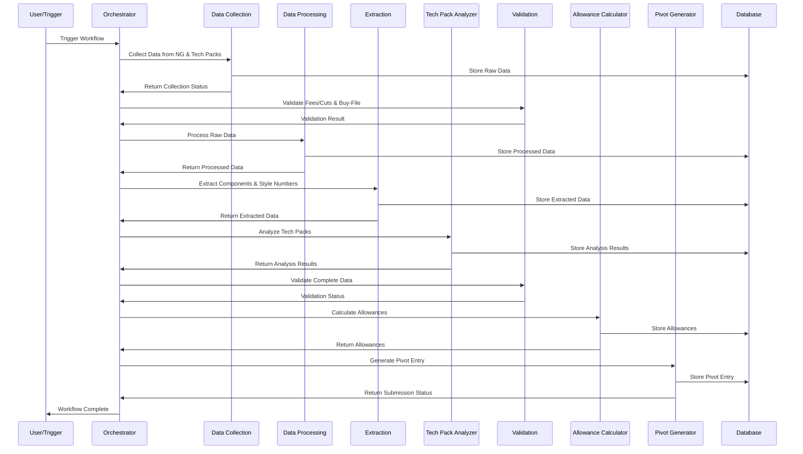
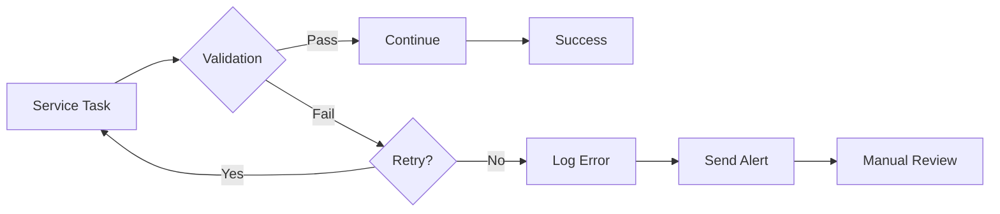

# Trim Ordering Automation - System Architecture

## Table of Contents
1. [Executive Summary](#executive-summary)
2. [System Architecture Diagram](#system-architecture-diagram)
3. [Component Breakdown](#component-breakdown)
4. [Data Flow Documentation](#data-flow-documentation)
5. [Integration Points](#integration-points)
6. [Implementation Recommendations](#implementation-recommendations)
7. [Technology Stack](#technology-stack)

---

## Executive Summary

This system automates the trim ordering workflow, reducing manual intervention from 7+ steps to an automated pipeline that processes data, validates information, and generates Pivot entries with minimal human oversight.

### Key Features
- Automated data collection from NG system
- Intelligent extraction of trim components
- Tech pack analysis and parsing
- Automated allowance calculations
- Error handling and validation at each stage
- Logging and audit trail
- Scalable microservices architecture

---

## System Architecture Diagram



---

## Component Breakdown

### 1. API Gateway Layer

**Purpose**: Entry point for all external requests and internal routing

**Responsibilities**:
- Authentication & authorization
- Request routing to appropriate services
- Rate limiting and throttling
- Request/response transformation
- Security (HTTPS, API keys, JWT)

**Technologies**: 
- Kong, AWS API Gateway, or Nginx with auth modules

---

### 2. Data Collection Service

**Purpose**: Extracts data from multiple sources (NG system, tech packs, PO files)

**Responsibilities**:
- Connect to NG database
- Download and parse PO line delivery schedule files
- Extract tech pack documents
- Download data files automatically
- Store raw data in object storage

**Key Functions**:
```python
- fetch_po_delivery_schedule(po_id)
- connect_ng_database(query_params)
- download_data_files(download_urls)
- extract_tech_pack_data(style_number)
```

**Technologies**:
- Python with psycopg2 for database connections
- Pandas for data processing
- FTP/SFTP libraries for file transfer
- BeautifulSoup for HTML parsing if needed

---

### 3. Data Processing Service

**Purpose**: Cleans, filters, and structures raw data

**Responsibilities**:
- Filter downloaded data for relevant information
- Normalize data formats
- Remove duplicates
- Structure data for downstream services

**Key Functions**:
```python
- filter_relevant_data(raw_data, criteria)
- normalize_style_numbers(data)
- extract_buyer_style_numbers(dataset)
- deduplicate_records(records)
```

**Technologies**:
- Python with Pandas
- Data validation libraries (Pydantic, Cerberus)

---

### 4. Extraction Service

**Purpose**: Extracts specific components from processed data

**Responsibilities**:
- Identify trim components from data
- Extract supplier information
- Parse style numbers and colors
- Categorize components by type

**Key Functions**:
```python
- extract_trim_components(processed_data)
- identify_suppliers(components)
- parse_style_info(style_data)
- categorize_components(components)
```

**Technologies**:
- Python with NLP libraries (spaCy, NLTK)
- Pattern matching (Regex, fuzzy matching)

---

### 5. Tech Pack Analyzer

**Purpose**: Analyzes tech packs to extract detailed component information

**Responsibilities**:
- Parse tech pack PDFs and documents
- Extract component materials
- Identify logos, colors, and label details
- Extract care label information
- Extract hangtag information

**Key Functions**:
```python
- parse_tech_pack(pdf_path)
- extract_materials(tech_pack)
- identify_logos_and_colors(tech_pack)
- extract_main_label_details(tech_pack)
- extract_care_labels(tech_pack)
- extract_hangtags(tech_pack)
```

**Technologies**:
- PDF parsing: PyPDF2, pdfplumber, or document AI
- OCR: Tesseract, AWS Textract, Google Document AI
- Computer Vision: OpenCV for logo detection
- ML models for smart extraction

---

### 6. Validation Service

**Purpose**: Validates data at each stage of the workflow

**Responsibilities**:
- Check for fees and cuts
- Validate "buy-file" options
- Verify style numbers and quantities
- Validate supplier information
- Ensure data completeness

**Key Functions**:
```python
- check_for_fees(po_data)
- evaluate_buy_file_option(data)
- validate_style_numbers(numbers)
- verify_supplier_info(suppliers)
- validate_data_completeness(trim_summary)
```

**Technologies**:
- Python with extensive validation rules
- Business logic engines
- Integration with external APIs for verification

---

### 7. Allowance Calculator

**Purpose**: Calculates appropriate allowances for trim components

**Responsibilities**:
- Apply business rules for allowances
- Calculate waste factors
- Apply seasonal variations
- Consider historical data
- Generate allowance recommendations

**Key Functions**:
```python
- calculate_allowances(trim_data, rules)
- apply_waste_factors(quantities)
- get_historical_allowances(style_type)
- generate_allowance_report()
```

**Technologies**:
- Python with calculation engines
- Machine learning for predictive allowances
- Business rules engine (Python-based)

---

### 8. Pivot Generator

**Purpose**: Creates Pivot entries from processed data

**Responsibilities**:
- Generate Pivot entries with all required fields
- Format data according to Pivot specifications
- Submit entries to Pivot system
- Track submission status
- Handle submission errors

**Key Functions**:
```python
- create_pbot_entry(trim_summary, allowances)
- format_pbot_data(entry)
- submit_to_pbot(entry)
- track_submission_status(entry_id)
```

**Technologies**:
- Python with API clients
- Integration with Pivot system API
- Webhook support for status updates

---

### 9. Workflow Orchestrator

**Purpose**: Coordinates all services in the correct sequence

**Responsibilities**:
- Manage workflow execution
- Handle retries and error recovery
- Schedule periodic runs
- Monitor service health
- Handle partial failures gracefully

**Technologies**:
- Apache Airflow, Dagster, or Prefect
- Celery for task queues
- AWS Step Functions or Azure Durable Functions

---

### 10. Supporting Infrastructure

#### Message Queue (RabbitMQ/Amazon SQS)
- Decouples services
- Enables async processing
- Provides reliability guarantees

#### Redis Cache
- Caches frequently accessed data
- Stores temporary computation results
- Session management

#### Logging Service
- Centralized logging (ELK Stack, Loki, Splunk)
- Structured logging with correlation IDs
- Real-time monitoring and alerting

#### Notification Service
- Sends alerts on errors
- Provides status updates
- Integrates with Slack, email, or other channels

---

## Data Flow Documentation

### Main Workflow Data Flow



### Error Handling Flow



---

## Integration Points

### 1. NG System Integration

**Type**: Database Integration

**Method**:
- Direct database connection via JDBC/ODBC
- Or API if available
- Scheduled data pulls or event-driven updates

**Authentication**: 
- Service account with read-only permissions
- Stored credentials in secure vault (Azure Key Vault, AWS Secrets Manager)

**Data Retrieved**:
- PO line delivery schedules
- Style information
- Supplier data
- Historical order data

---

### 2. Tech Pack Repository Integration

**Type**: File System/Storage Integration

**Method**:
- File system access or cloud storage API
- Automated download and parsing

**Authentication**:
- OAuth or API keys
- File permissions

**Data Retrieved**:
- Tech pack PDFs
- Design specifications
- Material requirements

---

### 3. Pivot System Integration

**Type**: API Integration

**Method**:
- RESTful API or SOAP
- POST requests for entry creation
- Webhook callbacks for status updates

**Authentication**:
- API key or OAuth
- Request signing

**Data Sent**:
- Trim components list
- Quantities and allowances
- Supplier information
- Style details

---

### 4. External Validation APIs

**Type**: Third-party API Integration

**Purpose**:
- Validate UPC codes
- Check supplier credentials
- Verify material specifications

**Examples**:
- GS1 API for barcode validation
- Supplier directory APIs

---

## Implementation Recommendations

### Phase 1: Foundation (Weeks 1-4)

1. **Setup Infrastructure**
   - Set up cloud environment (AWS/Azure/GCP)
   - Deploy message queue and database
   - Configure logging and monitoring
   - Set up CI/CD pipeline

2. **Build Core Services**
   - Data Collection Service (basic)
   - Data Processing Service
   - Database schema and models
   - Basic API Gateway

**Deliverables**:
- Basic data flow from NG system
- Storage layer operational
- Monitoring in place

---

### Phase 2: Core Automation (Weeks 5-8)

1. **Implement Key Services**
   - Extraction Service
   - Basic Tech Pack Analyzer
   - Validation Service
   - Pivot Generator

2. **Workflow Orchestration**
   - Configure Airflow/Dagster
   - Implement main workflow
   - Error handling and retries

**Deliverables**:
- End-to-end workflow operational
- Manual tech pack parsing working
- Basic Pivot entry generation

---

### Phase 3: Intelligence & Enhancement (Weeks 9-12)

1. **Advanced Tech Pack Analysis**
   - Implement OCR for PDFs
   - Train ML models for extraction
   - Logo detection
   - Color matching

2. **Smart Features**
   - Allowance calculation with ML
   - Anomaly detection
   - Historical pattern analysis
   - Predictive allowances

**Deliverables**:
- Automated tech pack parsing
- Intelligent allowance calculation
- Anomaly detection operational

---

### Phase 4: Optimization & Scale (Weeks 13-16)

1. **Performance Optimization**
   - Caching strategies
   - Parallel processing
   - Database optimization
   - API response times

2. **User Interface**
   - Dashboard for monitoring
   - Manual override capabilities
   - Reporting tools

**Deliverables**:
- High-performance system
- User-friendly dashboard
- Complete audit trail

---

## Technology Stack

### Backend Services

| Component | Recommendation | Alternatives |
|-----------|---------------|--------------|
| Language | Python 3.11+ | Java, Node.js, C# |
| Web Framework | FastAPI | Flask, Django |
| Database | PostgreSQL 15+ | MySQL, MongoDB |
| Cache | Redis | Memcached |
| Message Queue | RabbitMQ | Kafka, AWS SQS, Azure Service Bus |
| Object Storage | AWS S3 / Azure Blob | MinIO, Google Cloud Storage |

### Orchestration & Workflow

| Component | Recommendation | Alternatives |
|-----------|---------------|--------------|
| Orchestration | Apache Airflow | Dagster, Prefect, Temporal |
| Task Queue | Celery | RQ, Dramatiq |
| API Gateway | Kong | AWS API Gateway, Nginx |

### Data Processing & ML

| Component | Recommendation | Alternatives |
|-----------|---------------|--------------|
| Data Processing | Pandas, Polars | Apache Spark, Dask |
| ML Framework | scikit-learn, PyTorch | TensorFlow, XGBoost |
| OCR | Tesseract, AWS Textract | Google Document AI, Azure Form Recognizer |
| PDF Parsing | pdfplumber, PyPDF2 | AWS Textract |

### Infrastructure

| Component | Recommendation | Alternatives |
|---------|---------------|--------------|
| Cloud | AWS / Azure | GCP |
| Containerization | Docker | Podman |
| Orchestration | Kubernetes | Docker Swarm, Nomad |
| Secrets Management | HashiCorp Vault | AWS Secrets Manager, Azure Key Vault |

### Monitoring & Logging

| Component | Recommendation | Alternatives |
|-----------|---------------|--------------|
| Logging | ELK Stack (Elasticsearch, Logstash, Kibana) | Loki + Grafana, Splunk |
| Monitoring | Prometheus + Grafana | DataDog, New Relic |
| APM | OpenTelemetry | Jaeger, Zipkin |
| Alerts | PagerDuty | Opsgenie, Slack |

### Development & DevOps

| Component | Recommendation | Alternatives |
|-----------|---------------|--------------|
| Version Control | Git (GitHub/GitLab) | Bitbucket, Azure DevOps |
| CI/CD | GitHub Actions | Jenkins, GitLab CI, CircleCI |
| Testing | pytest | unittest, nose2 |
| Code Quality | black, pylint, mypy | ruff, flake8 |

---

## Security Considerations

### 1. Authentication & Authorization
- OAuth 2.0 / OpenID Connect for user authentication
- Service-to-service authentication using API keys or mTLS
- Role-based access control (RBAC)

### 2. Data Security
- Encryption at rest (database encryption)
- Encryption in transit (TLS 1.3)
- PII data masking
- Secure credential storage

### 3. Network Security
- VPC/network isolation
- Security groups/firewalls
- VPN for secure connections

### 4. Audit & Compliance
- Complete audit trail
- Data retention policies
- Compliance with industry standards (SOC 2, ISO 27001)

---

## Scalability Considerations

### Horizontal Scaling
- Services designed as stateless microservices
- Kubernetes auto-scaling based on CPU/memory
- Load balancing across instances

### Database Scaling
- Read replicas for query distribution
- Partitioning strategy for large tables
- Caching frequently accessed data

### Performance Optimization
- Async processing for long-running tasks
- Batch processing where possible
- Connection pooling
- Query optimization

---

## Error Handling Strategy

### 1. Retry Logic
- Exponential backoff for transient failures
- Maximum retry limits
- Circuit breaker pattern

### 2. Dead Letter Queues
- Failed messages moved to DLQ
- Manual intervention for DLQ messages
- Alert on DLQ message arrival

### 3. Graceful Degradation
- Fallback to manual process when critical failures occur
- Partial success handling
- Checkpoint/resume capabilities

### 4. Monitoring & Alerts
- Real-time health checks
- Automated alerting on failures
- Dashboards for system health

---

## Cost Estimation (Annual)

### Infrastructure Costs (Estimate)
- Cloud hosting: $5,000 - $15,000
- Database: $2,000 - $5,000
- Storage: $1,000 - $3,000
- Monitoring/Logging: $2,000 - $5,000
- API services (OCR, etc.): $3,000 - $10,000

**Total: $13,000 - $38,000/year**

*Note: Costs vary significantly based on usage and cloud provider*

---

## Success Metrics

### Key Performance Indicators (KPIs)
1. **Automation Rate**: % of orders fully automated
2. **Processing Time**: Reduction in manual hours
3. **Error Rate**: % of orders requiring manual correction
4. **Data Accuracy**: % of correct trim component identification
5. **Throughput**: Orders processed per day/hour
6. **Cost Savings**: Reduction in labor costs

### Target Goals (After Full Implementation)
- 95%+ automation rate
- 90% reduction in manual processing time
- <2% error rate
- 98%+ data accuracy
- Process 500+ orders per day
- 70% cost savings

---

## Conclusion

This architecture provides a comprehensive solution for automating the trim ordering workflow. The phased approach allows for incremental implementation while delivering value at each stage. The microservices design ensures scalability, maintainability, and the ability to update individual components without affecting the entire system.

